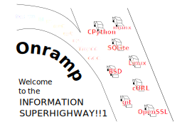
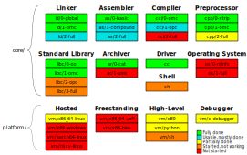

<div style="text-align:center">
    
</div>


# Onramp

Onramp is a virtualized implementation of C that can be bootstrapped from scratch on arbitrary hardware.

Starting in machine code, we implement...

- ...a [tool](platform/hex/) to convert [hexadecimal with comments](docs/hexadecimal.md) to raw bytes, in which we implement...
- ...a [virtual machine](platform/vm/) to run a [simple bytecode](docs/virtual-machine.md), in which we implement...
- ...a minimal [linker](core/ld/0-global) to resolve [labels](docs/object-code.md), in which we implement...
- ...an [assembler](core/as/) for a custom [assembly language](docs/assembly.md), in which we implement...
- ...a [compiler](core/cci/0-omc/) and [preprocessor](core/cpp/1-omc/) for a [minimal subset of C](docs/minimal-c.md), in which we implement...
- ...a [partial C99 compiler](core/cci/1-opc/) and [libc](core/libc/2-opc/), in which we implement...
- ...a C17 [compiler](core/cci/2-full/), [preprocessor](core/cpp/2-full/), [assembler](core/as/2-full), [linker](core/ld/2-full), [libc](core/libc/3-full) and related tools.

The resulting toolchain can (soon) bootstrap a native C compiler (e.g. TinyCC), which can bootstrap GCC, which can compile an entire system.

Only the first two steps are platform-specific. The entire rest of the process operates on a platform-independent bytecode. Onramp bytecode is simple to implement, simple to hand-write, and simple to compile to, making the entire bootstrap process as simple and portable as possible.

The platform-independence of Onramp makes present-day C trivially compilable by future archaeologists, alien civilizations, collapse recovery efforts and more. The goal of Onramp is to maintain a timeless and universal bootstrapping path to C.


## _What is self-bootstrapping?_

Most compilers are self-hosting: they are written in the language they compile. C compilers tend to be written in C, so to compile a C compiler, you need to already have a C compiler. This is a chicken-and-egg problem.

Onramp is instead self-bootstrapping: it can compile itself from scratch. Onramp is written in stages and broken up into small discrete tools. Each stage of each tool can be compiled by the stages before it. All stages are plain text, human-readable and heavily documented to make the entire process auditable.

All you need to compile and use Onramp are the initial stages: the [hex tool](platform/hex/) and [virtual machine](platform/vm/). These can easily be implemented by anyone in anything. Onramp includes implementations in handwritten [machine code](platform/vm/x86_64-linux/) as well as in high-level languages like [Python](platform/vm/python/) and [C](platform/vm/c/).

Once you have a VM, Onramp bootstraps itself. Read the [full bootstrapping path](docs/bootstrap-path.md) for details. Onramp follows in the footsteps of the [bcompiler](https://web.archive.org/web/20160502230021fw_/http://homepage.ntlworld.com/edmund.grimley-evans/bcompiler.html) and [stage-0](https://bootstrapping.miraheze.org/wiki/Stage0) bootstrapping projects; see the [inspiration](docs/inspiration.md) page for more.


## Under Construction!

Onramp is not yet complete. It doesn't compile much besides itself at the moment. My immediate goal is to support enough of C to compile Doom for command-line.

A near-term goal is to compile native compilers and tools: [TinyCC](https://en.wikipedia.org/wiki/Tiny_C_Compiler), [cproc](https://sr.ht/~mcf/cproc/)+[QBE](https://c9x.me/compile/), [chibicc](https://github.com/rui314/chibicc)/[Kefir](https://kefir.protopopov.lv/)+[binutils](https://www.gnu.org/software/binutils/), etc. A medium-term goal is to be able to boot a computer directly into a freestanding Onramp VM in order to bootstrap a modern OS kernel from source.

Onramp is an experiment in implementing C completely from scratch on a custom architecture, retaining all bootstrap stages in between. It is essentially three compilers, three preprocessors/assemblers/linkers, a multi-stage libc, a custom instruction set, several virtual machines, a debugger... It will take a long time to complete and there are many directions it can take in the future.

I welcome bug reports but I am not currently accepting contributions. Feel free to fork this and implement VMs but be aware that the bytecode format will change. (Also, I don't have good VM tests at the moment so you might have a lot of trouble debugging your VM.)


## Project Status

<div style="text-align:center">
    
</div>


## Build Status

[](https://github.com/ludocode/onramp/actions?query=workflow%3A%22Tests%22)


## Quick Start

WARNING: The final stage compiler and preprocessor are incomplete and not enabled in the bootstrap process. There is no support for function pointers, initializer lists, function-like macros, `#if`, `float`, `long long`, and much more. The compiler is not yet ready for real world use.

On POSIX systems, run the build script and put the results on your PATH.

```sh
scripts/posix/build.sh
export PATH=$PWD/build/posix/bin:$PATH
```

That's it! You can now compile C programs with `onrampcc`.

You'll need this PATH to run programs since they depend on `onrampvm`. If you'd like to install Onramp in `~/.local/bin` instead, run this:

```sh
scripts/posix/install.sh
```

Since Onramp is self-bootstrapping, this works even on a system that does not have a C compiler, binutils, make or any other build tools. Try it on a barebones x86\_64 Linux with nothing but coreutils.

See the [Setup Guide](docs/setup-guide.md) for more information on how to build Onramp and the [Usage Guide](docs/usage-guide.md) for how to use it.


## Project Organization

- [core/](core/) - Source code of the platform-independent parts of Onramp. Contains the compiler, linker, driver, libc, etc.
- [platform/](platform/) - Source code implementations of the platform-specific components of Onramp for various platforms.
- [scripts/](scripts/) - Scripts for building and installing Onramp on various platforms.
- [docs/](docs/) - Specifications of Onramp's languages and other documentation. Defines the Onramp subsets of C, Onramp Assembly, etc.
- [test/](test/) - Test cases and scripts for testing the various Onramp components.


## Documentation Index

- [Setup Guide](docs/setup-guide.md)
- [Usage Guide](docs/usage-guide.md)
- Languages:
    - [Onramp Hexadecimal](docs/hexadecimal.md)
    - [Onramp Virtual Machine and Bytecode](docs/virtual-machine.md)
    - [Onramp Assembly](docs/assembly.md)
    - [Onramp Minimal C](docs/minimal-c.md)
    - [Onramp Practical C](docs/practical-c.md)
    - [Onramp Shell](docs/shell.md)
    - [Onramp Debug Info](docs/debug-info.md)
- Miscellaneous:
    - [Bootstrap Path](docs/bootstrap-path.md)
    - [Coding Without Labels](docs/coding-without-labels.md)
    - [Inspiration](docs/inspiration.md)


## Components

Platform-specific:

| Program                    | Description            | Operation                                                |
|----------------------------|------------------------|----------------------------------------------------------|
| [`hex`](platform/hex/)     | Hex tool               | Converts hexadecimal `.ohx` to raw bytes                 |
| [`vm`](platform/vm/)       | Virtual machine        | Executes `.oe` bytecode, bridges filesystem when hosted  |

Platform-independent:

| Program               | Description            | Operation                                         |
|-----------------------|------------------------|---------------------------------------------------|
| [`cc`](core/cc/)      | Driver                 | Performs any or all phases of translation         |
| [`cpp`](core/cpp/)    | Preprocessor           | Preprocesses `.c` to `.i`                         |
| [`cci`](core/cci/)    | Compiler               | Compiles `.i` to `.os`                            |
| [`as`](core/as/)      | Assembler              | Assembles `.os` to `.oo` object file              |
| [`ar`](core/ar/)      | Archiver               | Combines `.oo` object files into `.oa` library    |
| [`ld`](core/ld/)      | Linker                 | Links `.oo` and `.oa` into `.oe` executable       |
| [`libc`](core/libc/)  | Standard library       | Provides C and POSIX library functions            |
| [`sh`](core/sh/)      | Shell                  | Runs scripts                                      |
| [`os`](core/os/)      | Operating System       | Implements a filesystem and syscalls              |


## File Types

| Extension   | Description                                                                                                    |
|-------------|----------------------------------------------------------------------------------------------------------------|
| `.ohx`      | [Onramp Hexadecimal](docs/hexadecimal.md), plain-text hexadecimal with comments                                |
| `.oe`       | [Onramp Executable](docs/virtual-machine.md), an Onramp bytecode program in binary                             |
| `.oo`       | [Onramp Object File](docs/object-code.md), plain-text bytecode with labels                                     |
| `.oa`       | [Onramp Archive](docs/object-code.md), a static library of `.oo` files                                         |
| `.os`       | [Onramp Assembly](docs/assembly.md), our custom assembly language                                              |
| `.i`        | Preprocessed C source code (no comments, no preprocessor directives)                                           |
| `.c`        | C source code, an Onramp Subset ([omC](docs/minimal-c.md) or [opC](docs/practical-c.md)) or a standard version |
| `.sh`       | [Onramp Shell](docs/shell.md), our subset of POSIX shell                                                       |
| `.od`       | [Onramp Debug Info](docs/debug-info.md), the debug symbols for an Onramp executable                            |


## Limitations

The Onramp C compiler targets a simple virtual machine with its own runtime environment and libc. This means it can't link against native libraries, and it can't do graphics, sound, networking, etc.

Onramp is not intended to be a general-purpose native compiler. It is intended (among other things) to bootstrap such a compiler.

The virtual machine therefore implements only those features that would be useful to a compilation environment. These features should nevertheless be sufficient to emulate much of a POSIX-like system, to support some basic coreutils and to run configure scripts and build tools and so on. A goal of Onramp is to be able to compile an entire native system including a kernel from a freestanding Onramp VM.
