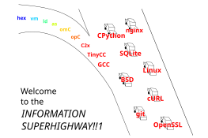

<div style="text-align:center">
    
</div>


# Onramp

Onramp is a virtualized implementation of C that can be bootstrapped from scratch on arbitrary hardware.

Starting in machine code, we implement...

- ...a [tool][hex] to convert [hexadecimal with comments][dochex] to raw bytes, in which we implement...
- ...a [virtual machine][vm] to run a [simple bytecode][docvm], in which we implement...
- ...a minimal [linker][ld0] to resolve [labels][docobj], in which we implement...
- ...an [assembler][as] for a custom [assembly language][docasm], in which we implement...
- ...a [compiler][cci0] and [preprocessor][cpp1] for a [minimal subset of C][omc], in which we implement...
- ...a [partial C99 compiler][cci1] and [libc][libc2], in which we implement...
- ...a C17 [compiler][cci2], [preprocessor][cpp2], [assembler][as2], [linker][ld2], [libc][libc3] and related tools.

The resulting toolchain can (soon) bootstrap a native C compiler (e.g. TinyCC), which can bootstrap GCC, which can compile an entire system.

Only the first two steps are platform-specific. The entire rest of the process operates on a platform-independent bytecode. Onramp bytecode is simple to implement, simple to hand-write, and simple to compile to, making the entire bootstrap process as simple and portable as possible.

The platform independence of Onramp makes present-day C trivially compilable by future archaeologists, alien civilizations, collapse recovery efforts and more. The goal of Onramp is to maintain a timeless and universal bootstrapping path to C.


## _What is self-bootstrapping?_

Most compilers are self-hosting: they are written in the language they compile. C compilers tend to be written in C, so to compile a C compiler, you need to already have a C compiler. This is a chicken-and-egg problem.

Onramp is instead self-bootstrapping: it can compile itself from scratch. Onramp is written in stages and broken up into small discrete tools. Each stage of each tool can be compiled by the stages before it. All stages are plain text, human-readable and heavily documented to make the entire process auditable.

All you need to compile and use Onramp are the initial stages: the [hex tool][hex] and [virtual machine][vm]. These can easily be implemented by anyone in anything. Onramp includes implementations in handwritten [machine code][vmx64lin] as well as in high-level languages like [Python][vmpy] and [C][vmc89].

Once you have a VM, Onramp bootstraps itself. Read the [full bootstrapping path][docpath] for details. Onramp follows in the footsteps of the [bcompiler] and [stage-0] bootstrapping projects; see the [inspiration] page for more.


## Under Construction!

Onramp is not yet complete. [It can compile Doom][doom], but not much else at the moment. It is missing floating point support and most libc functionality.

A near-term goal is to compile native compilers and tools: [TinyCC], [cproc]+[QBE], [chibicc]/[Kefir]+[binutils], etc. A medium-term goal is to be able to boot a computer directly into a freestanding Onramp VM in order to bootstrap a modern OS kernel from source.

Onramp is an experiment in implementing C completely from scratch on a custom architecture, retaining all bootstrap stages in between. It is essentially three compilers, three preprocessors/assemblers/linkers, a multi-stage libc, a custom instruction set, several virtual machines, a debugger... It will take a long time to complete and there are many directions it can take in the future.


## Quick Start

WARNING: The libc is incomplete and there is no support for floating point math. Onramp is not yet ready for real world use.

On POSIX systems:

```sh
./configure.sh
./build.sh
./install.sh
```

That's it! This installs Onramp in `~/.local/` so you'll need `~/.local/bin/` on your PATH. You can now compile programs with `onrampcc`.

Since Onramp is self-bootstrapping, this works even on a system that does not have a C compiler, binutils, make or any other build tools. Try it on a barebones x86\_64 Linux with nothing but coreutils.

Try `./configure.sh --help` for many more options. See the [Setup Guide][docsetup] for installation instructions and the [Usage Guide][docusage] for how to use it.


## Project Status

See the [Implementation Status](docs/status.md) document for a breakdown of implemented and missing features.

#### [Core](core/)

| [Linker][ld]           | [Assembler][as]          | [Code Generator][cg]  | [Compiler][cci]        | [Preprocessor][cpp]     |
|:-----------------------|:-------------------------|:----------------------|:-----------------------|:------------------------|
| 🟩 [ld/0-global][ld0]  | 🟩 [as/0-basic][as0]     | 🟩 [cg/0-asm][cg0]    | 🟩 [cci/0-omc][cci0]   | 🟩 [cpp/0-strip][cpp0]  |
| 🟩 [ld/1-omc][ld1]     | 🟦 [as/1-compound][as1]  | 🟥 [cg/1-full][cg1]   | 🟩 [cci/1-opc][cci1]   | 🟩 [cpp/1-omc][cpp1]    |
| 🟦 [ld/2-full][ld2]    | 🟦 [as/2-full][as2]      |                       | 🟦 [cci/2-full][cci2]  | 🟦 [cpp/2-full][cpp2]   |

| [Standard Library][libc] | [Archiver][ar]       | [Operating System][os]  | [Driver][cc]     | [Shell][sh]  |
|:-------------------------|:---------------------|:------------------------|:-----------------|--------------|
| 🟩 [libc/0-oo][libc0]    | 🟩 [ar/0-cat][ar0]   | 🟥 [os/0-minfs][os0]    | 🟦 [cc]          | 🟦 [sh]      |
| 🟩 [libc/1-omc][libc1]   | 🟥 [ar/1-unix][ar1]  | 🟥 [os/1-full][os1]     |                  |              |
| 🟨 [libc/2-opc][libc2]   |                      |                         |                  |              |
| 🟧 [libc/3-full][libc3]  |                      |                         |                  |              |

#### [Platform](platform/)

| Hosted                             | Freestanding                      | High-Level                   |
|:-----------------------------------|:----------------------------------|:-----------------------------|
| 🟦 [vm/x86\_64-linux][vmx64lin]    | 🟥 [vm/x86\_64-uefi][vmx64uefi]   | 🟨 [vm/c-debugger][vmdebug]  |
| 🟥 [vm/x86-windows][vmx86win]      | 🟥 [vm/x86-bios][vmx86bios]       | 🟦 [vm/c89][vmc89]           |
| 🟥 [vm/aarch64-linux][vmarm64lin]  |                                   | 🟦 [vm/python][vmpy]         |
| 🟥 [vm/riscv32-linux][vmrv32lin]   |                                   | 🟧 [vm/sh][vmsh]             |

#### [Extra](extra/)

| Disassembler       | Syscall Tracer       | VM Info Tool         |
|:-------------------|:---------------------|:---------------------|
| 🟧 [disas][disas]  | 🟥 [strace][strace]  | 🟩 [vminfo][vminfo]  |

#### Legend

- 🟩 Done
- 🟦 Usable, mostly done
- 🟨 Partially done
- 🟧 Started, not working
- 🟥 Not started


## Build Status

[](https://github.com/ludocode/onramp/actions/workflows/test.yml)


## Contributing

Contributions are welcome! I am especially looking for bug reports, general feedback, bug fixes and libc improvements. You can also support the project financially via [GitHub Sponsors][sponsors].

The primary Onramp repository is hosted [here on GitHub][upstream] but you don't have to use GitHub if you don't want to. Feel free to host a fork or mirror anywhere. Code contributions can be done by GitHub pull request, by sending me links to your external fork, or simply by emailing me patches.

Authors retain copyright over their code contributions, but all code in this repository must be MIT licensed. By contributing to Onramp you agree to license your contributions under the MIT license and you assert that you have the right to do so.

Onramp is handwritten by humans. Please do not use large language models in your contributions. LLM-generated pull requests and LLM-generated bug reports will be rejected, and autonomous agents are not permitted to interact with the project. If you are not comfortable in English, feel free to file bug reports in your native language.


## Documentation

Some important guides for using Onramp are:

- [Setup Guide](docs/setup-guide.md)
- [Usage Guide](docs/usage-guide.md)

All Onramp tools and languages are extensively specified. See the [Documentation Reference](docs/README.md) for a complete listing of all Onramp documentation.


## _Why bootstrap?_

**Security**: Compiler binaries can contain malware and [backdoors] that insert viruses into programs they compile. Malicious code in a compiler can even recognize its own source code and propagate itself. Recompiling a compiler with itself therefore does not eliminate the threat. The only compiler that can truly be trusted is one that you've bootstrapped from scratch.

**Preservation**: We have a duty to preserve information and media about our culture, our history, and our world for future generations. We need to make it possible for contemporary codecs and compression algorithms to run on hardware we can't even concieve of. The best way to do that is to [preserve the code][arctic-vault], along with the tools to compile it on anything.

**Education**: Bootstrapping demonstrates the entire stack from machine code to a high-level language. Students can observe how every step of the process works, and in the case of Onramp, on a simplified machine with simplified tools and languages.

**Fun**: Modern languages and frameworks have little connection to how hardware really works. Layers of complexity and waste continue to build upon one another, and goals of simplicity and efficiency have been abandoned by the industry. Bootstrapping is a respite from this. Working with the bare metal, writing low-level code, understanding every part of the machine and the toolchain can reignite our passion for software and bring much needed joy back into programming.


## Limitations

The Onramp C compiler targets a simple virtual machine with its own runtime environment and libc. This means it can't link against native libraries, and it can't do graphics, sound, networking, etc.

Onramp is not intended to be a general-purpose native compiler. It is intended (among other things) to bootstrap such a compiler.

The virtual machine therefore implements only those features that would be useful to a compilation environment. These features should nevertheless be sufficient to emulate much of a POSIX-like system, to support some basic coreutils and to run configure scripts and build tools and so on. A goal of Onramp is to be able to compile an entire native system including a kernel from a freestanding Onramp VM.


<!--
Markdown link references follow.

Links are separated in order to make the main text more legible when read in plain text, especially in tables.

In some cases we avoid pulling out links where they are more convenient inline, for example in the documentation index.
-->

<!-- core -->
[ar0]: core/ar/0-cat/
[ar1]: core/ar/1-unix/
[ar]: core/ar/
[as0]: core/as/0-basic/
[as1]: core/as/1-compound/
[as2]: core/as/2-full/
[as]: core/as/
[cc]: core/cc/
[cci0]: core/cci/0-omc/
[cci1]: core/cci/1-opc/
[cci2]: core/cci/2-full/
[cci]: core/cci/
[cg0]: core/cg/0-asm/
[cg1]: core/cg/1-full/
[cg]: core/cg/
[cpp0]: core/cpp/0-strip/
[cpp1]: core/cpp/1-omc/
[cpp2]: core/cpp/2-full/
[cpp]: core/cpp/
[hex]: platform/hex/
[ld0]: core/ld/0-global/
[ld1]: core/ld/1-omc/
[ld2]: core/ld/2-full/
[ld]: core/ld/
[libc0]: core/libc/0-oo/
[libc1]: core/libc/1-omc/
[libc2]: core/libc/2-opc/
[libc3]: core/libc/3-full/
[libc]: core/libc/
[os0]: core/os/0-minfs/
[os1]: core/os/1-full/
[os]: core/os/
[sh]: core/sh/

<!-- platform -->
[vm]: platform/vm/
[vmarm64lin]: platform/vm/aarch64-linux
[vmc89]: platform/vm/c89
[vmdebug]: platform/vm/c-debugger
[vmpy]: platform/vm/python
[vmrv32lin]: platform/vm/riscv32-linux
[vmsh]: platform/vm/sh
[vmx64lin]: platform/vm/x86_64-linux
[vmx64uefi]: platform/vm/x86_64-uefi
[vmx86bios]: platform/vm/x86-bios
[vmx86win]: platform/vm/x86-windows

<!-- extra -->
[disas]: extra/disas/
[vminfo]: extra/vminfo/
[strace]: extra/strace/

<!-- docs -->
[docasm]: docs/assembly.md
[docdebug]: docs/debug-info.md
[dochex]: docs/hexadecimal.md
[docir]: docs/intermediate-representation.md
[docobj]: docs/object-code.md
[docpath]: docs/bootstrap-path.md
[docsetup]: docs/setup-guide.md
[docsh]: docs/shell.md
[docusage]: docs/usage-guide.md
[docvm]: docs/virtual-machine.md
[inspiration]: docs/inspiration.md
[omc]: docs/minimal-c.md
[opc]: docs/practical-c.md

<!-- external links -->
[arctic-vault]: https://archiveprogram.github.com/arctic-vault/
[backdoors]: https://en.wikipedia.org/wiki/Backdoor_(computing)#Compiler_backdoors
[bcompiler]: https://web.archive.org/web/20160502230021fw_/http://homepage.ntlworld.com/edmund.grimley-evans/bcompiler.html
[binutils]: https://www.gnu.org/software/binutils/
[chibicc]: https://github.com/rui314/chibicc
[cproc]: https://sr.ht/~mcf/cproc/
[doom]: https://ludocode.com/blog/onramp-can-compile-doom
[gfm]: https://github.github.com/gfm/
[kefir]: https://kefir.protopopov.lv/
[qbe]: https://c9x.me/compile/
[sponsors]: https://github.com/sponsors/ludocode
[stage-0]: https://bootstrapping.miraheze.org/wiki/Stage0
[tinycc]: https://en.wikipedia.org/wiki/Tiny_C_Compiler
[upstream]: https://github.com/ludocode/onramp
